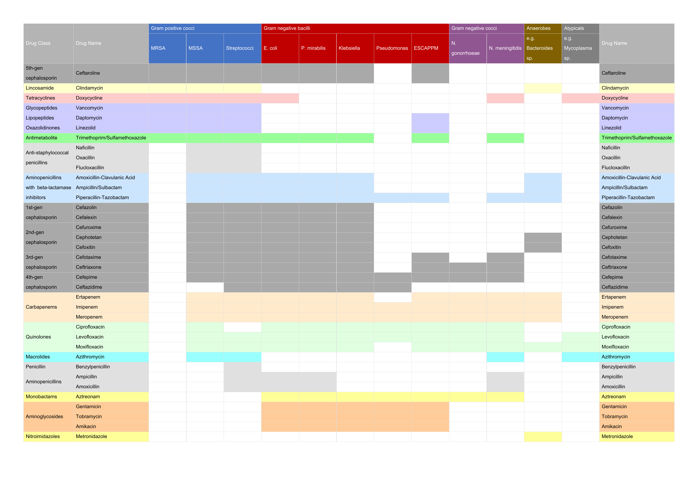

## Open Antibiogram: A User-friendly Antibiotics Sensitivity Chart

A simple antibiotic sensitivity chart. This version is aimed at senior medical student / early residents, but is hopefully helpful to a variety of people. Please contribute (especially if you find errors!).

### Full-Screen Image
[View Full-Screen Image](./full_screen_image.html)
### PDF Version
[View PDF](./assets/antibiogram.pdf)

## Sources/Inspiration:
- Forked from Alex Goodell's [Open Antibiogram](https://github.com/alexgoodell/antibiogram)
- [Sanford Guide to Antimicrobial Therapy Mobile](http://sanfordguide.com/)
- [James McCormack's Antibiotic Sensitivity Chart](http://therapeuticseducation.org/sites/therapeuticseducation.org/files/Antibiotic_Sensitivity_December_2015.pdf)
- [Wellington ICU Antibiotic Summary](http://wellingtonicu.com/Drug/PDF/Wellington%20ICU%20Antibiotic%20Summary.pdf)
- [An Infectious Disease Compendium: A Persiflagers Guide](http://pusware.com/testpus/index.html)
- [MediaWiki Abx Guide](http://mediwikis.com/wiki/index.php/Causative_Organisms_and_Antibiotics_Guide)
- [KendallPark's Antiobiotics Chart](https://www.reddit.com/r/medicalschool/comments/6lb7ae/antibiotics_sensitivity_chart_in_spreadsheet/)

## GitHub Project Page
[Go to GitHub repository](https://github.com/nocalla/antibiogram)
